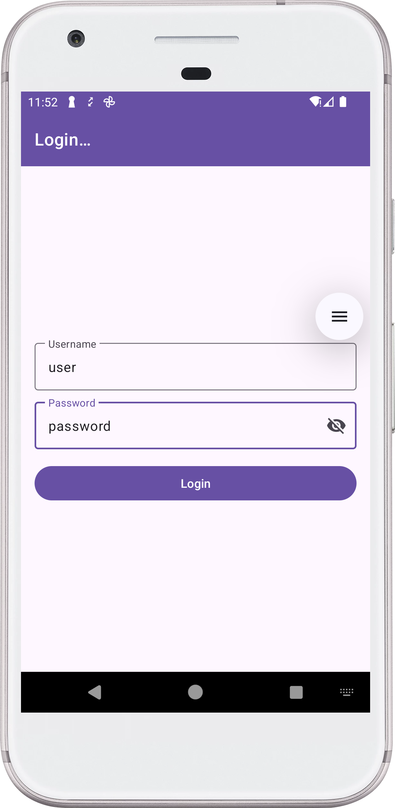
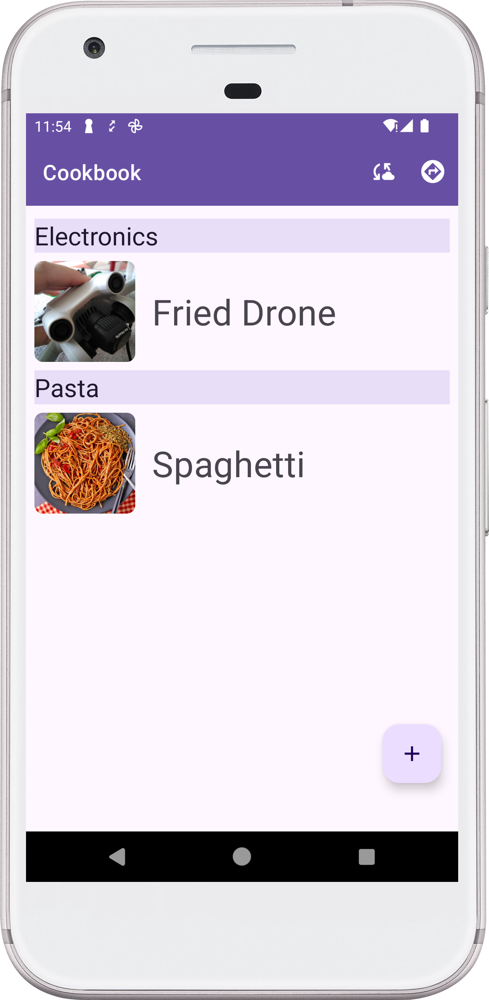
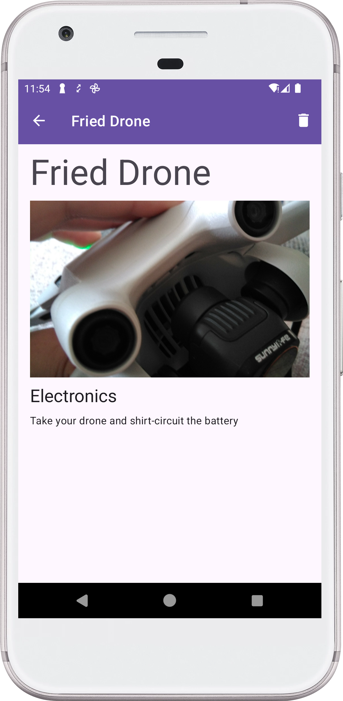
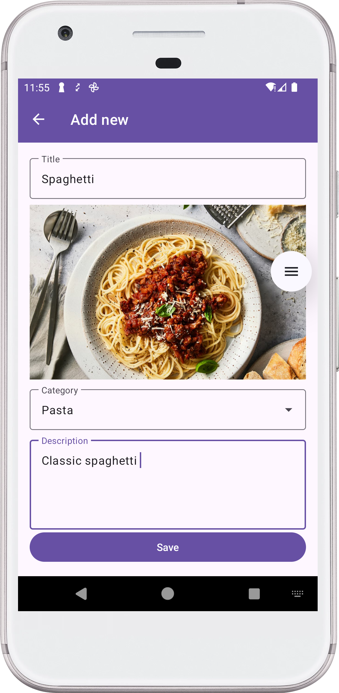

# Приложение "Поваренная книга"

В этой папке лежит основа приложения для нескольких занятий по теме архитектуры и работе с данными.
Семинары, которые посвящены этим темам будут последовательно достраивать приложение шаг за шагом.
Таким образом, ветки последующих семинаров будут содержать изменения по предыдущим темам.

## Тестовый сервер:

Приложение использует HTTP-сервер для синхронизации поваренной книги. Для запуска сервера воспользуйтесь задачей `run` соответствующего модуля из панели Gradle 
или введите команду в терминале:
```shell
./gradlew :cookbook:server:run
```

Сервер будет запущен на локальном компьютере:

- Хост: `0.0.0.0`
- Порт: `8080`

В этой конфигурации он [доступен для приложения](https://developer.android.com/studio/run/emulator-networking#networkaddresses), запущенного на эмуляторе
по адресу:

- Хост: `10.0.2.2`
- Порт: `8080`

Если вы хотите запустить приложение на телефоне, измените конфигурацию сервера в [файле настроек](server/src/main/kotlin/com/motorro/cookbook/server/Constants.kt).

## Документация OpenAPI

Сервер содержит [файл документации](server/src/main/resources/openapi/documentation.yaml) своих методов и выдает в хорошо читаемом виде по ссылке:
[http://0.0.0.0:8080/openapi](http://0.0.0.0:8080/openapi).

## Шаблон мобильного приложения

Наше мобильное приложение - это упрощенная версия "Поваренной книги", которую мы делали на практике по компонентам навигации.
Приложение состоит из следующих экранов:

### Экран авторизации (login)



- Авторизация в приложении управляется классом [SessionManager](cookbook/src/main/kotlin/com/motorro/cookbook/app/session/SessionManager.kt)
- Пользователь на сервере:
  - login: `user`
  - password: `password`

### Список рецептов



Экран списка рецептов, разбитый по категориям. Экран доступен авторизованным пользователям. В верхнем тул-баре две кнопки:

- Обновление списка
- Выход пользователя

### Экран рецепта



Экран рецепта с подробной информацией. Экран доступен авторизованным пользователям. В верхнем тул-баре находится кнопка удаления рецепта.

### Экран нового рецепта



Экран добавления нового рецепта. Чтобы добавить рецепт, укажите:

- название
- картинку (необязательно)
- категорию (из списка или новую)
- шаги приготовления


