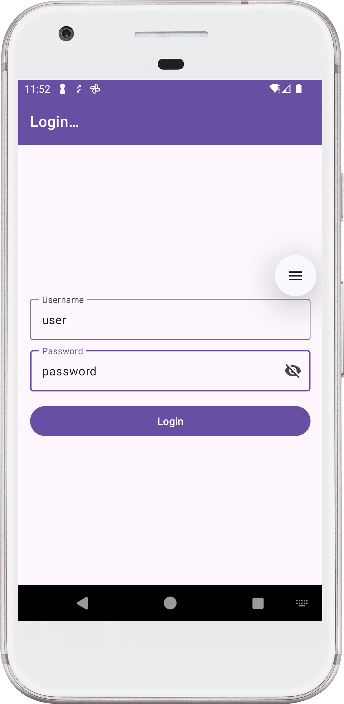
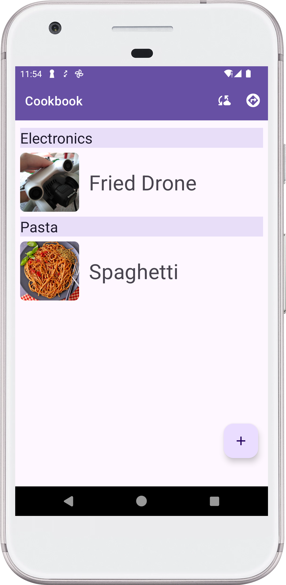
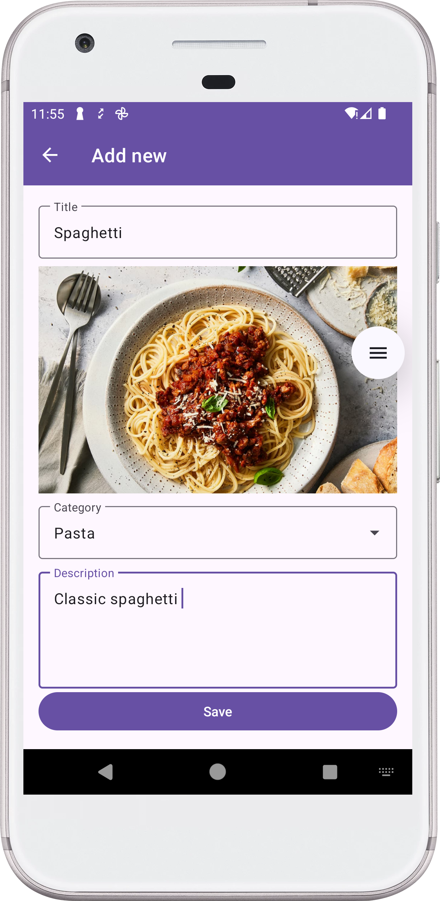

# Приложение "Поваренная книга"

***[Read in English](#cookbook-application)***

В этой папке лежит основа приложения для нескольких занятий по теме архитектуры и работе с данными.
Семинары, которые посвящены этим темам будут последовательно достраивать приложение шаг за шагом.
Таким образом, ветки последующих семинаров будут содержать изменения по предыдущим темам.

## Тестовый сервер:

Приложение использует HTTP-сервер для синхронизации поваренной книги. Для запуска сервера воспользуйтесь задачей `run` соответствующего модуля из панели Gradle 
или введите команду в терминале:
```shell
./gradlew :cookbook:server:run
```

Сервер будет запущен на локальном компьютере:

- Хост: `0.0.0.0`
- Порт: `8080`

В этой конфигурации он [доступен для приложения](https://developer.android.com/studio/run/emulator-networking#networkaddresses), запущенного на эмуляторе
по адресу:

- Хост: `10.0.2.2`
- Порт: `8080`

Если вы хотите запустить приложение на телефоне, измените конфигурацию сервера в [файле настроек](server/src/main/kotlin/com/motorro/cookbook/server/Constants.kt).

## Документация OpenAPI

Сервер содержит [файл документации](server/src/main/resources/openapi/documentation.yaml) своих методов и выдает в хорошо читаемом виде по ссылке:
[http://0.0.0.0:8080/openapi](http://0.0.0.0:8080/openapi).

## Шаблон мобильного приложения

Наше мобильное приложение - это упрощенная версия "Поваренной книги", которую мы делали на практике по компонентам навигации.
Приложение состоит из следующих экранов:

### Экран авторизации (login)



- Авторизация в приложении управляется классом [SessionManager](cookbook/src/main/kotlin/com/motorro/cookbook/app/session/SessionManager.kt)
- Пользователь на сервере:
  - login: `user`
  - password: `password`

### Список рецептов



Экран списка рецептов, разбитый по категориям. Экран доступен авторизованным пользователям. В верхнем тул-баре две кнопки:

- Обновление списка
- Выход пользователя

### Экран рецепта


Экран рецепта с подробной информацией. Экран доступен авторизованным пользователям. В верхнем тул-баре находится кнопка удаления рецепта.

### Экран нового рецепта



Экран добавления нового рецепта. Чтобы добавить рецепт, укажите:

- название
- картинку (необязательно)
- категорию (из списка или новую)
- шаги приготовления

---

# "Cookbook" Application

This folder contains the foundation of an application for several lessons on architecture and data handling.
The seminars dedicated to these topics will build upon the application step by step.
Thus, the branches for subsequent seminars will contain changes from previous topics.

## Test Server:

The application uses an HTTP server to synchronize the cookbook. To start the server, use the `run` task of the corresponding module from the Gradle panel
or enter the command in the terminal:
```shell
./gradlew :cookbook:server:run
```

The server will be launched on the local machine:

- Host: `0.0.0.0`
- Port: `8080`

In this configuration, it is [accessible to the application](https://developer.android.com/studio/run/emulator-networking#networkaddresses) running on an emulator
at the following address:

- Host: `10.0.2.2`
- Port: `8080`

If you want to run the application on a phone, change the server configuration in the [settings file](server/src/main/kotlin/com/motorro/cookbook/server/Constants.kt).

## OpenAPI Documentation

The server contains a [documentation file](server/src/main/resources/openapi/documentation.yaml) for its methods and provides it in a human-readable format at the link:
[http://0.0.0.0:8080/openapi](http://0.0.0.0:8080/openapi).

## Mobile Application Template

Our mobile application is a simplified version of the "Cookbook" that we created during the navigation components practice.
The application consists of the following screens:

### Login Screen


- Application authorization is managed by the [SessionManager](cookbook/src/main/kotlin/com/motorro/cookbook/app/session/SessionManager.kt) class.
- Server user:
  - login: `user`
  - password: `password`

### Recipe List


A screen with a list of recipes, categorized. The screen is available to authorized users. The top toolbar has two buttons:

- Refresh list
- Logout

### Recipe Screen


A screen with detailed information about a recipe. The screen is available to authorized users. The top toolbar has a button to delete the recipe.

### New Recipe Screen


A screen for adding a new recipe. To add a recipe, specify:

- name
- image (optional)
- category (from the list or a new one)
- cooking steps
