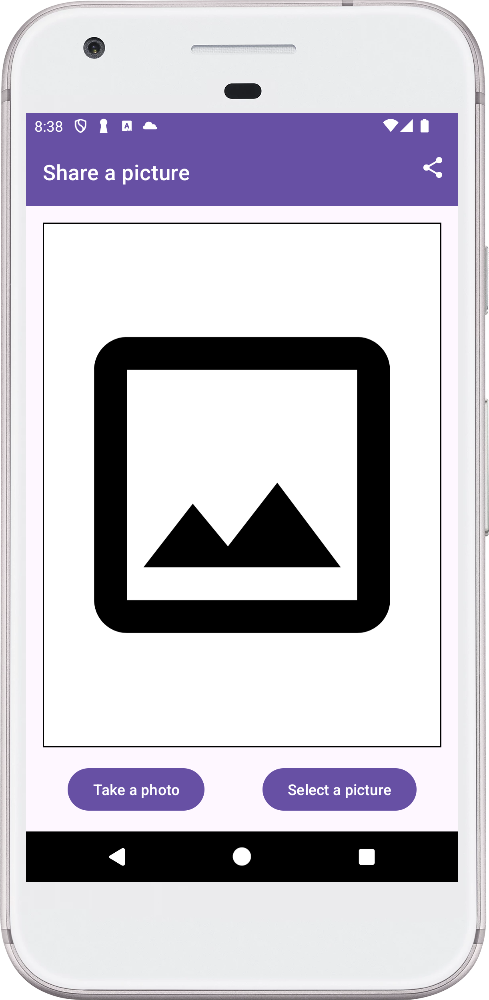
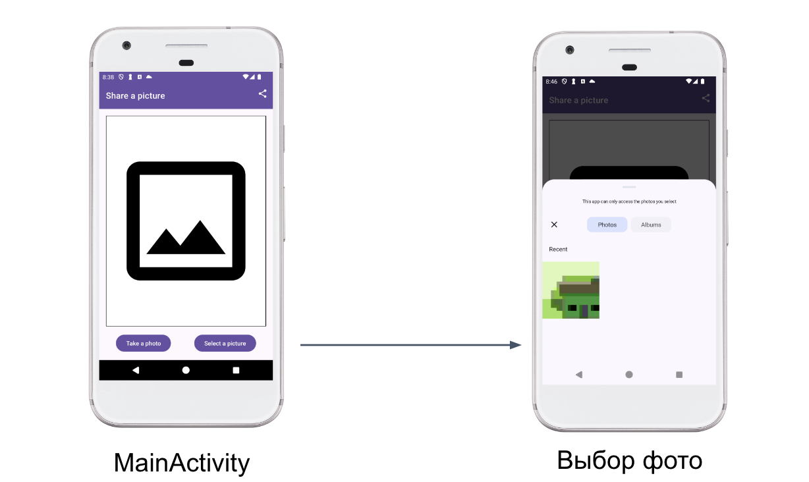
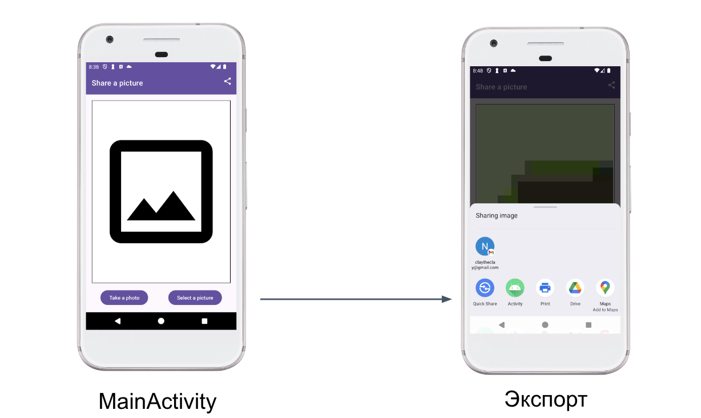
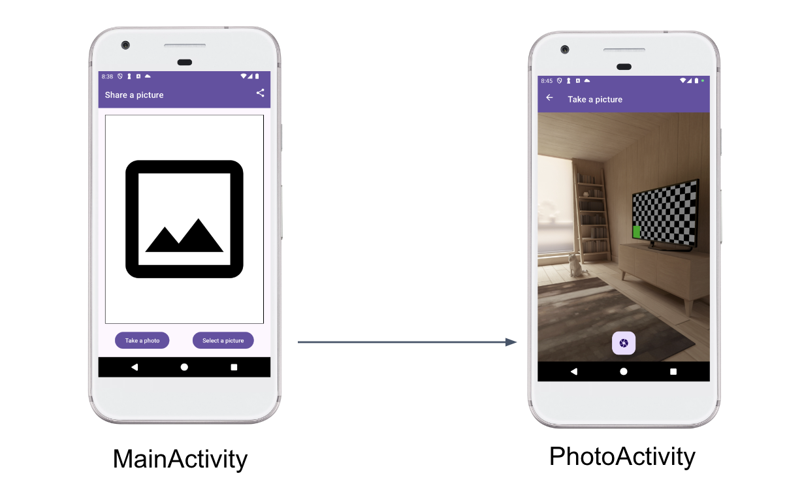
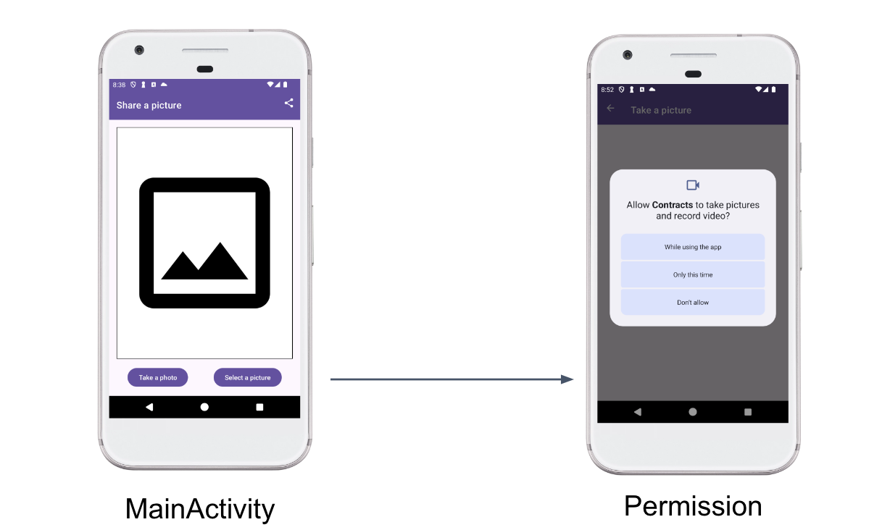
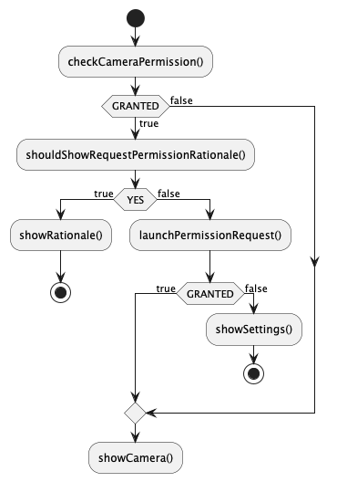
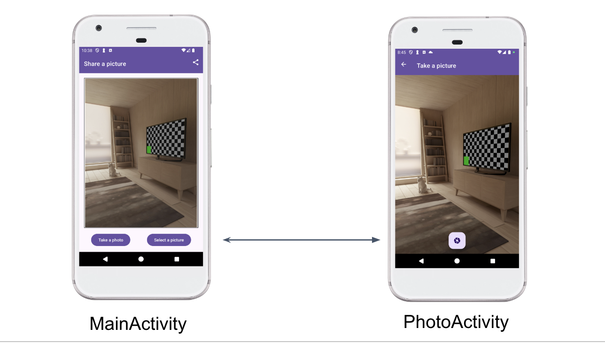

# Практическая работа Activity - Intents, Contracts


## Задача
Перед вами приложение, которое может поделиться фотографией с другими приложениями. 
Вам предстоит добавить недостающие части:

1. Создание контракта для получения фотографии из галереи
2. Создание Intent для экспорта фотографии в другие приложения
3. Создание контракта для обмена фотографиями между Activity
4. Создание контракта и логики запроса разрешения на доступ к камере

## 1. Контракт для получения фотографии из галереи


В приложении создана `MainActivity`, которая отображает выбранную фотографию и кнопку для выбора фотографии из галереи.
Предварительный скелет контракта `selectContract` размещен в [MainActivity](src/main/kotlin/com/motorro/android/contracts/MainActivity.kt).
Окончите реализацию контракта и добавьте его вызов в `MainActivity`:

1. Используйте один из стандартных вариантов [ActivityResultContracts](https://developer.android.com/reference/androidx/activity/result/contract/ActivityResultContracts) 
   для получения фотографии из галереи.
2. Вызовите `selectContract` при нажатии на кнопку выбора фотографии `btnSelectPicture`.
3. Запишите результат в переменную `sharedImageUri` в `MainActivity`

## 2. Intent для экспорта фотографии в другие приложения


В `MainActivity` отображается выбранная из галереи или фотоаппарата фотография и сделана кнопка для экспорта фотографии в другие приложения.
После того, как вы получили фотографию из галереи, вам необходимо поделиться ей с другими приложениями.
Для этого, в правом верхнем углу экрана добавлена кнопка `Share` и создан обработчик ее нажатия - функция `shareImage`.
Закончите реализацию функции `shareImage`:

1. Создайте неявный Intent для отправки фотографии в другие приложения. Обратитесь к документации [Intent.ACTION_SEND](https://developer.android.com/reference/android/content/Intent#ACTION_SEND) 
   для установки всех параметров Intent.
2. Создайте Intent выбора приложения с помощью [Intent.createChooser](https://developer.android.com/reference/android/content/Intent#createChooser(android.content.Intent,%20java.lang.CharSequence)
   и Intent из пункта 1.
3. Запустите Chooser с помощью `startActivity`.

## 3. Контракт для запуска PhotoActivity


В приложении созданы две Activity:

- `MainActivity` - стартовая Activity, отображает выбранную фотографию и кнопки для выбора фотографии из галереи, съемки фотографии и экспорта фотографии 
  в другие приложения.
- `PhotoActivity` - Activity для съемки фотографии.

Необходимо создать контракт для обмена фотографиями между `MainActivity` и `PhotoActivity`.

- В `PhotoActivity` необходимо передать [настройки](src/main/kotlin/com/motorro/android/contracts/data/ImageSettings.kt) съемки фотографии.
- В `MainActivity` необходимо получить ссылку на фотографию и разместить в окошке предпросмотра.

Предварительный скелет контракта `TakePhotoContract` размещен в [PhotoActivity](src/main/kotlin/com/motorro/android/contracts/PhotoActivity.kt).
Окончите реализацию контракта и добавьте его вызов в `MainActivity`:

1. Сделайте `ImageSettings` Parcelable при помощи [Parcelize](https://developer.android.com/kotlin/parcelize)
2. Реализуйте запись настроек съемки фотографии из Intent в `createIntent` в `PhotoActivity`
3. Добавьте метод получения настроек съемки из Intent
4. Создайте экземпляр `photoContract` в `MainActivity`
5. Вызовите `photoContract` при нажатии на кнопку съемки фотографии `btnTakePhoto`.

## 4. Контракт и логика запроса разрешения на доступ к камере


Для того, чтобы сделать фотографию, необходимо запросить разрешение на доступ к камере.
Вам необходимо добавить контракт для запроса разрешения на доступ к камере и логику его обработки.
В `PhotoActivity` добавлены функции для отображения состояния разрешения и заглушка контракта запроса разрешения:

- `checkCameraPermission` - проверяет наличие разрешения и запрашивает его, если оно отсутствует.
- `launchPermissionRequest` - запускает контракт запроса разрешения на доступ к камере.
- `gotoSettings` - переходит в настройки приложения.
- `showCamera` - отображает камеру. Вызывается, когда разрешение получено.
- `showSettings` - отображает приглашение перейти в настройки приложения. Вызывается, когда разрешение не получено.
- `showRationale` - отображает объяснение причины запроса разрешения. Вызывается, когда разрешение не получено и необходимо объяснение.

Логика работы Activity и вызова функций должна быть следующая:


Выполните следующие шаги:

1. Добавьте необходимые [разрешения](https://developer.android.com/training/permissions/declaring) в манифест:
    ```xml
    <uses-feature android:name="android.hardware.camera.any" android:required="true"/>
    <uses-permission android:name="android.permission.CAMERA"/>
    ```
2. Создайте контракт для запроса разрешения на доступ к камере в [PhotoActivity](src/main/kotlin/com/motorro/android/contracts/PhotoActivity.kt).
   Предварительный скелет контракта сформирован в переменной `permissionContract`.
3. В случае, когда разрешение получено, вызовите функцию `showCamera` в `PhotoActivity`.
4. В случае, когда разрешение не получено, вызовите функцию `showSettings` в `PhotoActivity`.
6. Реализуйте функцию `checkCameraPermission` в `PhotoActivity` в соответствии с [рекомендацией Google](https://developer.android.com/training/permissions/requesting#workflow_for_requesting_permissions):
   1. Проверьте наличие разрешений
   2. Вызовите `shouldShowRequestPermissionRationale` для проверки необходимости объяснения причины запроса разрешения
   3. Запросите разрешение с помощью запуска контракта `permissionContract`

## 5. Возврат результата в контракте


В контракте `TakePhotoContract` в `PhotoActivity` необходимо вернуть результат съемки фотографии в `MainActivity`.
Для этого вам необходимо:

1. Реализовать тело функции `onPhotoTaken` в `PhotoActivity`: установить результат в `RESULT_OK` и передать ссылку на фотографию в `Intent`.
2. Реализовать тело функции `onCancel` в `PhotoActivity`: установить результат в `RESULT_CANCELED`.
3. Реализуйте получение ссылки на фотографию из Intent в методе `parseResult` контракта в `PhotoActivity`.
4. Запишите результат в переменную `sharedImageUri` в контракте запуска фото в `MainActivity`.
