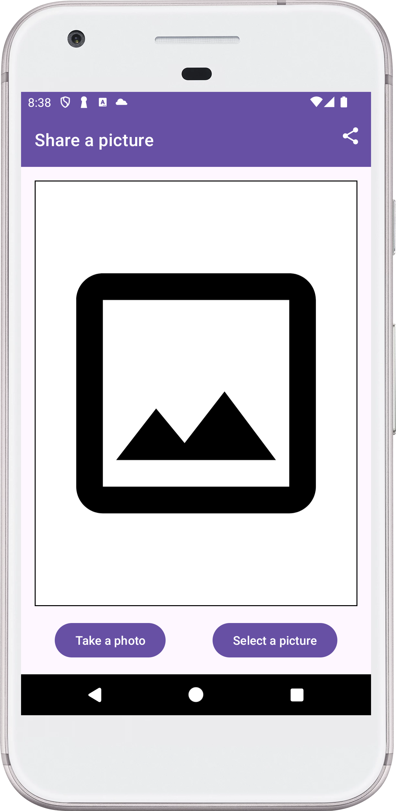
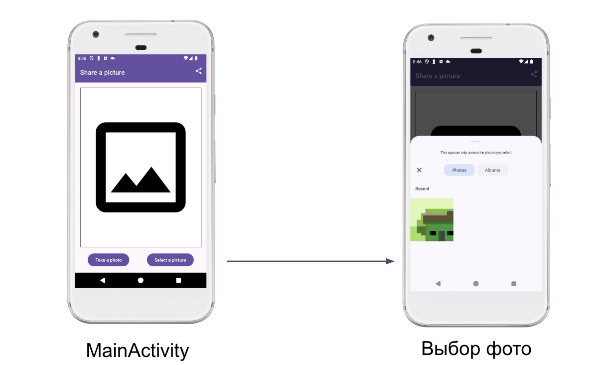
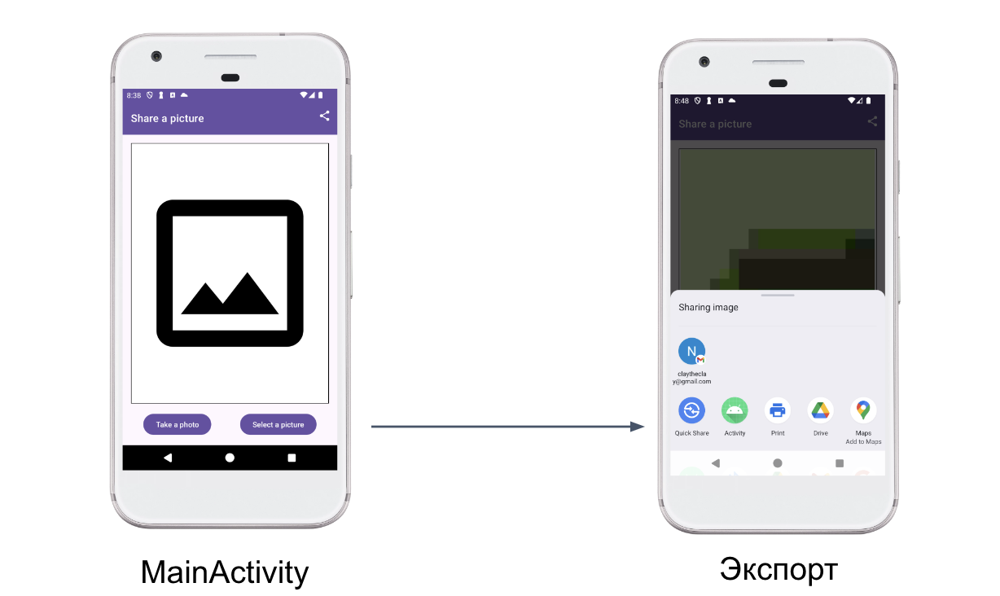
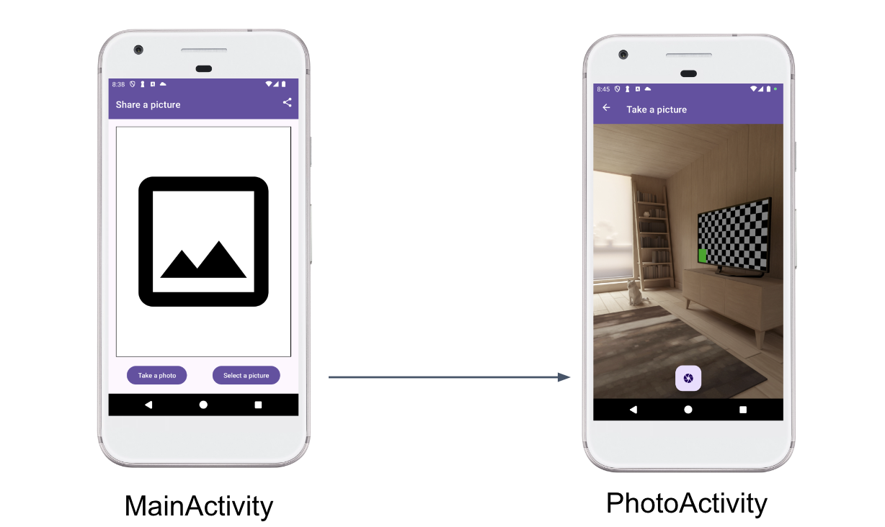
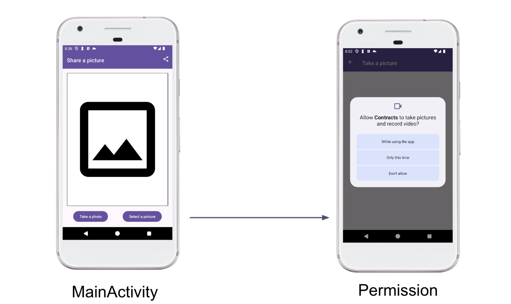
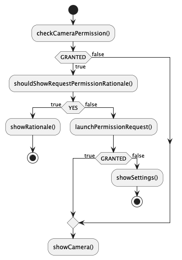
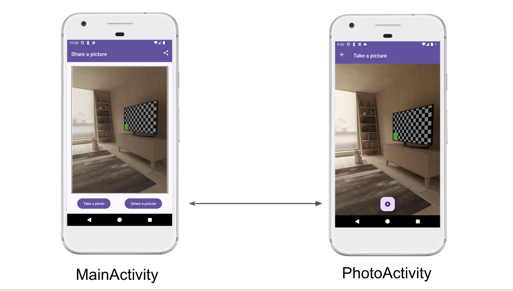

# Практическая работа Activity - Intents, Contracts

***[Read in English](#practice-activity---intents-contracts)***



## Задача
Перед вами приложение, которое может поделиться фотографией с другими приложениями. 
Вам предстоит добавить недостающие части:

1. Создание контракта для получения фотографии из галереи
2. Создание Intent для экспорта фотографии в другие приложения
3. Создание контракта для обмена фотографиями между Activity
4. Создание контракта и логики запроса разрешения на доступ к камере

## 1. Контракт для получения фотографии из галереи


В приложении создана `MainActivity`, которая отображает выбранную фотографию и кнопку для выбора фотографии из галереи.
Предварительный скелет контракта `selectContract` размещен в [MainActivity](src/main/kotlin/com/motorro/android/contracts/MainActivity.kt).
Окончите реализацию контракта и добавьте его вызов в `MainActivity`:

1. Используйте один из стандартных вариантов [ActivityResultContracts](https://developer.android.com/reference/androidx/activity/result/contract/ActivityResultContracts) 
   для получения фотографии из галереи.
2. Вызовите `selectContract` при нажатии на кнопку выбора фотографии `btnSelectPicture`.
3. Запишите результат в переменную `sharedImageUri` в `MainActivity`

## 2. Intent для экспорта фотографии в другие приложения


В `MainActivity` отображается выбранная из галереи или фотоаппарата фотография и сделана кнопка для экспорта фотографии в другие приложения.
После того, как вы получили фотографию из галереи, вам необходимо поделиться ей с другими приложениями.
Для этого, в правом верхнем углу экрана добавлена кнопка `Share` и создан обработчик ее нажатия - функция `shareImage`.
Закончите реализацию функции `shareImage`:

1. Создайте неявный Intent для отправки фотографии в другие приложения. Обратитесь к документации [Intent.ACTION_SEND](https://developer.android.com/reference/android/content/Intent#ACTION_SEND) 
   для установки всех параметров Intent.
2. Создайте Intent выбора приложения с помощью [Intent.createChooser](https://developer.android.com/reference/android/content/Intent#createChooser(android.content.Intent,%20java.lang.CharSequence)
   и Intent из пункта 1.
3. Запустите Chooser с помощью `startActivity`.

## 3. Контракт для запуска PhotoActivity


В приложении созданы две Activity:

- `MainActivity` - стартовая Activity, отображает выбранную фотографию и кнопки для выбора фотографии из галереи, съемки фотографии и экспорта фотографии 
  в другие приложения.
- `PhotoActivity` - Activity для съемки фотографии.

Необходимо создать контракт для обмена фотографиями между `MainActivity` и `PhotoActivity`.

- В `PhotoActivity` необходимо передать [настройки](src/main/kotlin/com/motorro/android/contracts/data/ImageSettings.kt) съемки фотографии.
- В `MainActivity` необходимо получить ссылку на фотографию и разместить в окошке предпросмотра.

Предварительный скелет контракта `TakePhotoContract` размещен в [PhotoActivity](src/main/kotlin/com/motorro/android/contracts/PhotoActivity.kt).
Окончите реализацию контракта и добавьте его вызов в `MainActivity`:

1. Сделайте `ImageSettings` Parcelable при помощи [Parcelize](https://developer.android.com/kotlin/parcelize)
2. Реализуйте запись настроек съемки фотографии из Intent в `createIntent` в `PhotoActivity`
3. Добавьте метод получения настроек съемки из Intent
4. Создайте экземпляр `photoContract` в `MainActivity`
5. Вызовите `photoContract` при нажатии на кнопку съемки фотографии `btnTakePhoto`.

## 4. Контракт и логика запроса разрешения на доступ к камере


Для того, чтобы сделать фотографию, необходимо запросить разрешение на доступ к камере.
Вам необходимо добавить контракт для запроса разрешения на доступ к камере и логику его обработки.
В `PhotoActivity` добавлены функции для отображения состояния разрешения и заглушка контракта запроса разрешения:

- `checkCameraPermission` - проверяет наличие разрешения и запрашивает его, если оно отсутствует.
- `launchPermissionRequest` - запускает контракт запроса разрешения на доступ к камере.
- `gotoSettings` - переходит в настройки приложения.
- `showCamera` - отображает камеру. Вызывается, когда разрешение получено.
- `showSettings` - отображает приглашение перейти в настройки приложения. Вызывается, когда разрешение не получено.
- `showRationale` - отображает объяснение причины запроса разрешения. Вызывается, когда разрешение не получено и необходимо объяснение.

Логика работы Activity и вызова функций должна быть следующая:


Выполните следующие шаги:

1. Добавьте необходимые [разрешения](https://developer.android.com/training/permissions/declaring) в манифест:
    ```xml
    <uses-feature android:name="android.hardware.camera.any" android:required="true"/>
    <uses-permission android:name="android.permission.CAMERA"/>
    ```
2. Создайте контракт для запроса разрешения на доступ к камере в [PhotoActivity](src/main/kotlin/com/motorro/android/contracts/PhotoActivity.kt).
   Предварительный скелет контракта сформирован в переменной `permissionContract`.
3. В случае, когда разрешение получено, вызовите функцию `showCamera` в `PhotoActivity`.
4. В случае, когда разрешение не получено, вызовите функцию `showSettings` в `PhotoActivity`.
6. Реализуйте функцию `checkCameraPermission` в `PhotoActivity` в соответствии с [рекомендацией Google](https://developer.android.com/training/permissions/requesting#workflow_for_requesting_permissions):
   1. Проверьте наличие разрешений
   2. Вызовите `shouldShowRequestPermissionRationale` для проверки необходимости объяснения причины запроса разрешения
   3. Запросите разрешение с помощью запуска контракта `permissionContract`

## 5. Возврат результата в контракте


В контракте `TakePhotoContract` в `PhotoActivity` необходимо вернуть результат съемки фотографии в `MainActivity`.
Для этого вам необходимо:

1. Реализовать тело функции `onPhotoTaken` в `PhotoActivity`: установить результат в `RESULT_OK` и передать ссылку на фотографию в `Intent`.
2. Реализовать тело функции `onCancel` в `PhotoActivity`: установить результат в `RESULT_CANCELED`.
3. Реализуйте получение ссылки на фотографию из Intent в методе `parseResult` контракта в `PhotoActivity`.
4. Запишите результат в переменную `sharedImageUri` в контракте запуска фото в `MainActivity`.

---

# Practice: Activity - Intents, Contracts


## Task
You have an application that can share a photo with other applications.
You need to add the missing parts:

1. Create a contract to get a photo from the gallery.
2. Create an Intent to export a photo to other applications.
3. Create a contract to exchange photos between Activities.
4. Create a contract and logic to request permission to access the camera.

## 1. Contract to get a photo from the gallery


The application has a `MainActivity` that displays the selected photo and a button to select a photo from the gallery.
A preliminary skeleton of the `selectContract` is located in [MainActivity](src/main/kotlin/com/motorro/android/contracts/MainActivity.kt).
Complete the implementation of the contract and add its call in `MainActivity`:

1. Use one of the standard options from [ActivityResultContracts](https://developer.android.com/reference/androidx/activity/result/contract/ActivityResultContracts)
   to get a photo from the gallery.
2. Call `selectContract` when the `btnSelectPicture` button is clicked.
3. Write the result to the `sharedImageUri` variable in `MainActivity`.

## 2. Intent to export a photo to other applications


`MainActivity` displays the photo selected from the gallery or camera and has a button to export the photo to other applications.
After you have received the photo from the gallery, you need to share it with other applications.
For this, a `Share` button has been added in the upper right corner of the screen, and a click handler for it has been created - the `shareImage` function.
Complete the implementation of the `shareImage` function:

1. Create an implicit Intent to send the photo to other applications. Refer to the [Intent.ACTION_SEND](https://developer.android.com/reference/android/content/Intent#ACTION_SEND)
   documentation to set all the Intent parameters.
2. Create an application chooser Intent using [Intent.createChooser](https://developer.android.com/reference/android/content/Intent#createChooser(android.content.Intent,%20java.lang.CharSequence)
   and the Intent from step 1.
3. Launch the Chooser using `startActivity`.

## 3. Contract to launch PhotoActivity


The application has two Activities:

- `MainActivity` - the starting Activity, displays the selected photo and buttons to select a photo from the gallery, take a photo, and export the photo
  to other applications.
- `PhotoActivity` - an Activity for taking a photo.

You need to create a contract to exchange photos between `MainActivity` and `PhotoActivity`.

- `PhotoActivity` needs to be passed the photo [settings](src/main/kotlin/com/motorro/android/contracts/data/ImageSettings.kt).
- `MainActivity` needs to receive a link to the photo and display it in the preview window.

A preliminary skeleton of the `TakePhotoContract` is located in [PhotoActivity](src/main/kotlin/com/motorro/android/contracts/PhotoActivity.kt).
Complete the implementation of the contract and add its call in `MainActivity`:

1. Make `ImageSettings` Parcelable using [Parcelize](https://developer.android.com/kotlin/parcelize).
2. Implement writing the photo settings from the Intent in `createIntent` in `PhotoActivity`.
3. Add a method to get the photo settings from the Intent.
4. Create an instance of `photoContract` in `MainActivity`.
5. Call `photoContract` when the `btnTakePhoto` button is clicked.

## 4. Contract and logic for requesting camera permission


To take a photo, you need to request permission to access the camera.
You need to add a contract for requesting camera permission and the logic for handling it.
`PhotoActivity` has functions for displaying the permission state and a stub for the permission request contract:

- `checkCameraPermission` - checks for the permission and requests it if it is missing.
- `launchPermissionRequest` - launches the contract to request camera permission.
- `gotoSettings` - goes to the application settings.
- `showCamera` - displays the camera. Called when the permission is granted.
- `showSettings` - displays a prompt to go to the application settings. Called when the permission is not granted.
- `showRationale` - displays an explanation for the permission request. Called when the permission is not granted and an explanation is needed.

The logic of the Activity and function calls should be as follows:


Follow these steps:

1. Add the necessary [permissions](https://developer.android.com/training/permissions/declaring) to the manifest:
    ```xml
    <uses-feature android:name="android.hardware.camera.any" android:required="true"/>
    <uses-permission android:name="android.permission.CAMERA"/>
    ```
2. Create a contract to request camera permission in [PhotoActivity](src/main/kotlin/com/motorro/android/contracts/PhotoActivity.kt).
   A preliminary skeleton of the contract is formed in the `permissionContract` variable.
3. If the permission is granted, call the `showCamera` function in `PhotoActivity`.
4. If the permission is not granted, call the `showSettings` function in `PhotoActivity`.
6. Implement the `checkCameraPermission` function in `PhotoActivity` according to the [Google recommendation](https://developer.android.com/training/permissions/requesting#workflow_for_requesting_permissions):
   1. Check for permissions.
   2. Call `shouldShowRequestPermissionRationale` to check if an explanation for the permission request is needed.
   3. Request the permission by launching the `permissionContract`.

## 5. Returning a result in the contract


In the `TakePhotoContract` in `PhotoActivity`, you need to return the result of taking the photo to `MainActivity`.
To do this, you need to:

1. Implement the body of the `onPhotoTaken` function in `PhotoActivity`: set the result to `RESULT_OK` and pass the link to the photo in the `Intent`.
2. Implement the body of the `onCancel` function in `PhotoActivity`: set the result to `RESULT_CANCELED`.
3. Implement getting the link to the photo from the Intent in the `parseResult` method of the contract in `PhotoActivity`.
4. Write the result to the `sharedImageUri` variable in the photo launch contract in `MainActivity`.
