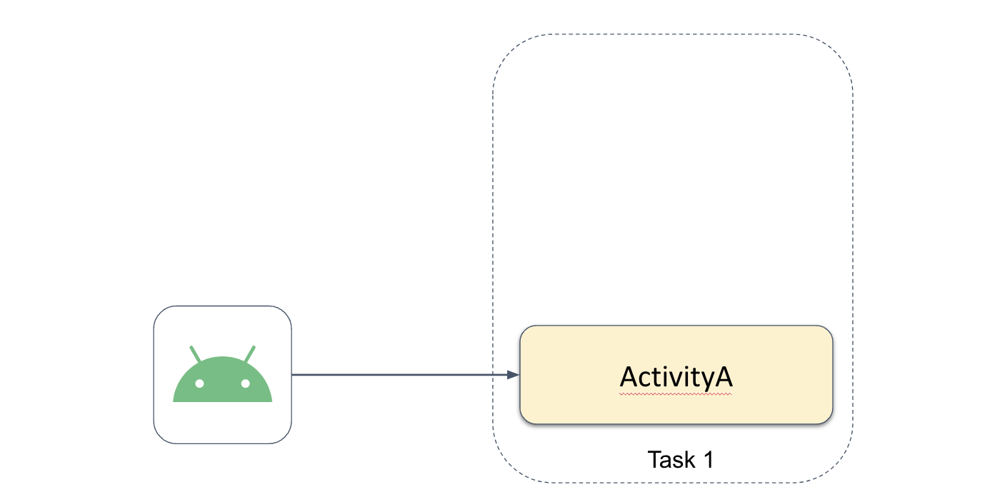
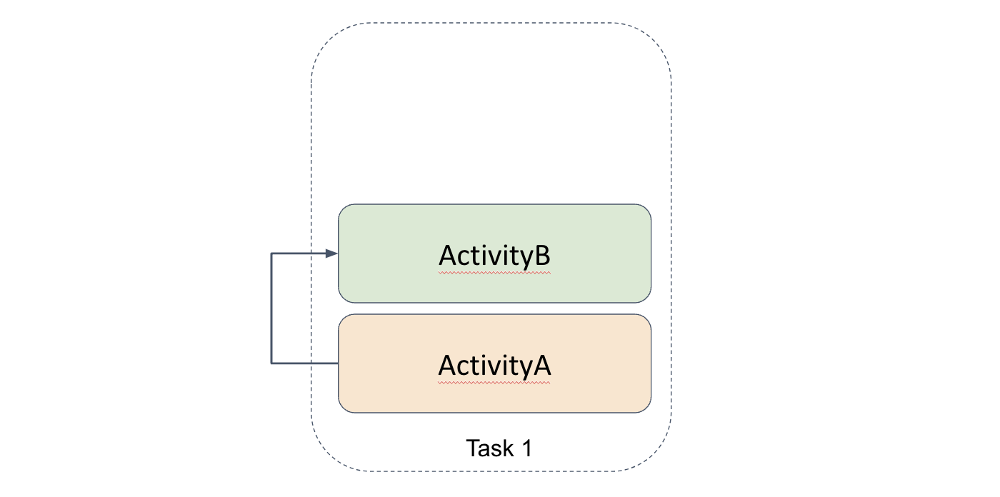
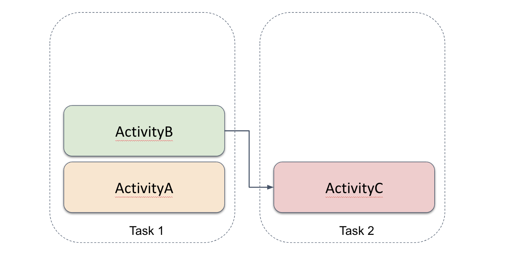
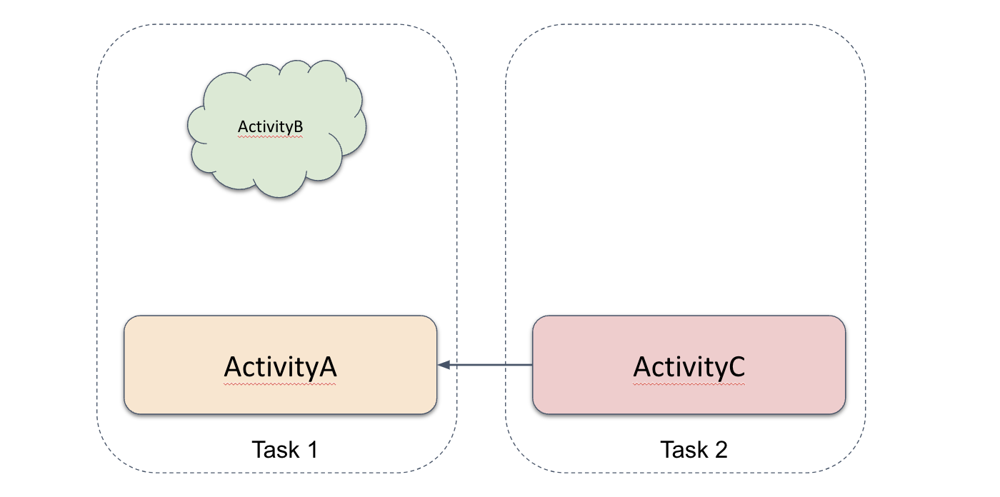
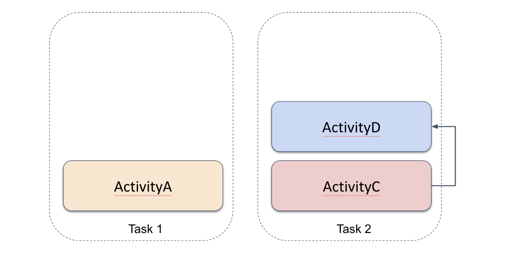
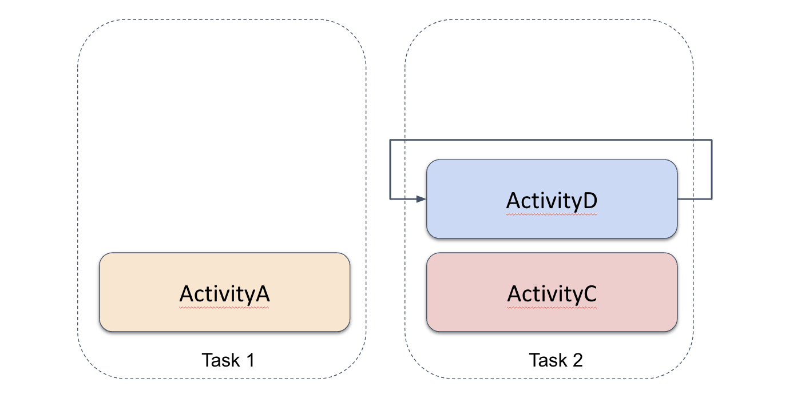
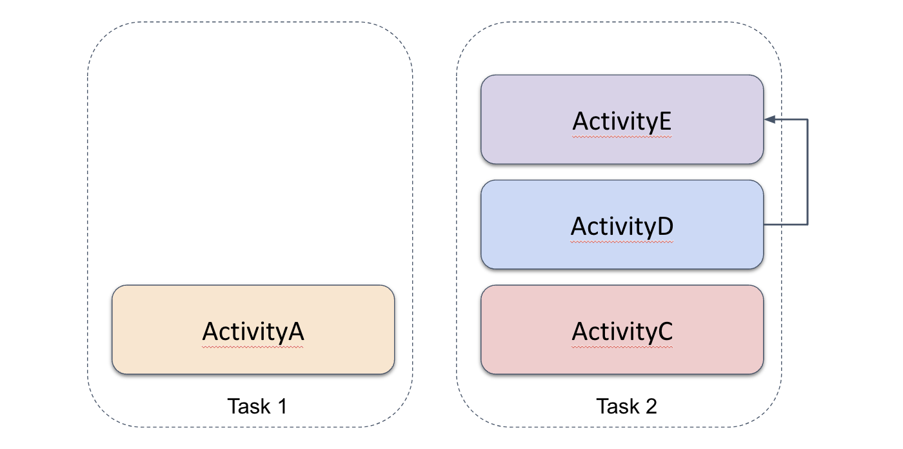
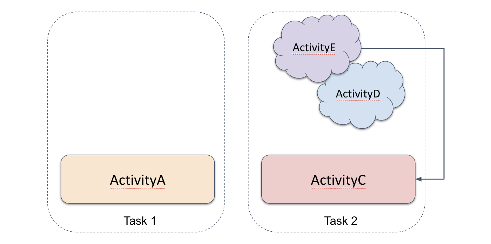

# Практическая работа Activity - LaunchMode

В проекте создано 4 Activity: `ActivityA`, `ActivityB`, `ActivityC`, `ActivityD`.

Вам предстоит расставить параметры манифеста и флаги Intent для Activity так, чтобы приложение вело себя следующим образом:

1. `ActivityA` - стартовая Activity для приложения, нужно добавить необходимые параметры в манифест.
   
2. При нажатии кнопки `Open ActivityB` в `ActivityA` создается новый экземпляр `ActivityB` в текущей задаче.
   
3. При нажатии кнопки `Close` в `ActivityB` закрывается `ActivityB` и возвращаемся на `ActivityA`.
4. При нажатии кнопки `Open ActivityC` в `ActivityB` создается новый экземпляр `ActivityC` в отдельной задаче.
   
5. При нажатии кнопки `Open ActivityA` в `ActivityC` запускается существующая `ActivityA` и получает новый Intent. Все остальные Activity в задаче выше по стеку удаляются.
   
6. При нажатии кнопки `Open ActivityD` в `ActivityC` создается новый экземпляр `ActivityD` в той же задаче, что и `ActivityC`.
   
7. При нажатии кнопки `Open ActivityD` в `ActivityD` она получает новый Intent.
   
8. При нажатии кнопки `Open ActivityE` в `ActivityE` создается новый экземпляр `ActivityE` в той же задаче.
   
9. При нажатии кнопки `Open ActivityD` в `ActivityE` создается новый экземпляр `ActivityD` в той же задаче, что и `ActivityE`.
10. При нажатии кнопки `Return to ActivityC` в `ActivityE` очистить текущую задачу до находящейся внизу стека `ActivityC`, которая получает новый Intent.
    

