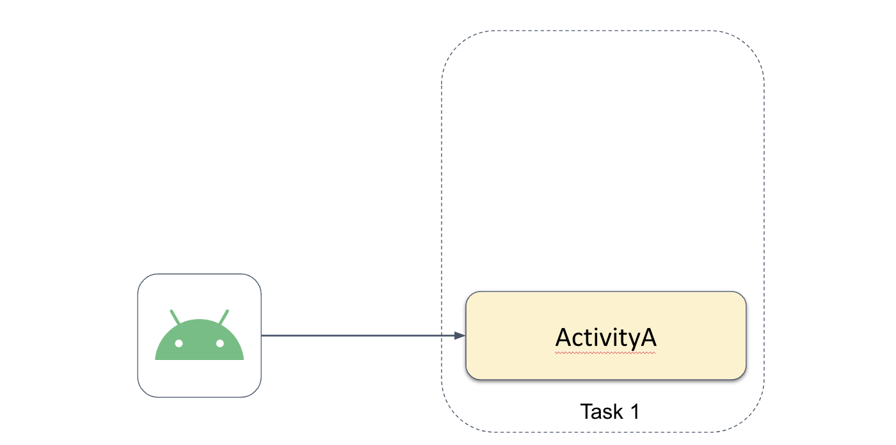
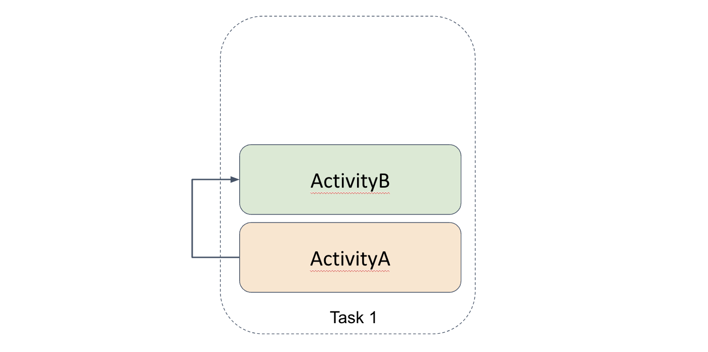
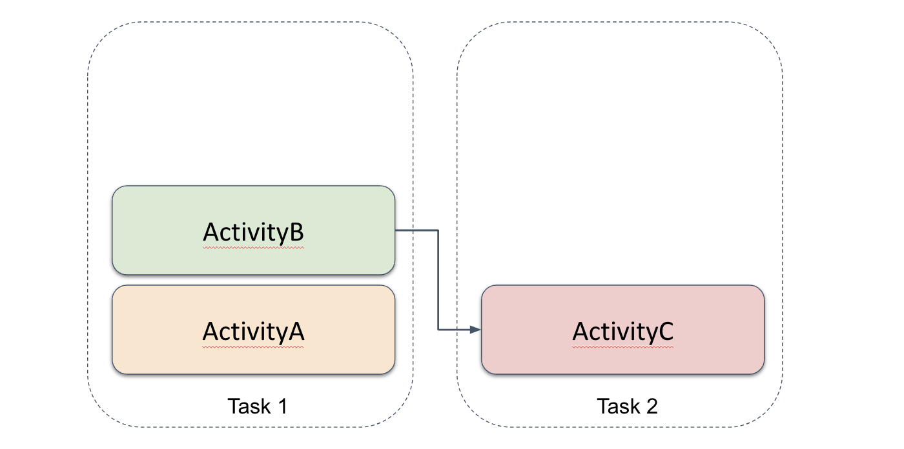
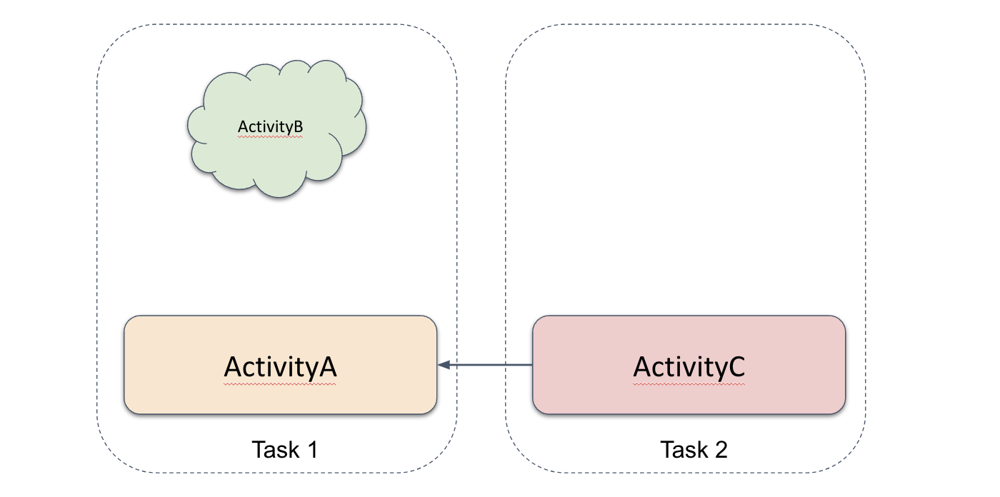
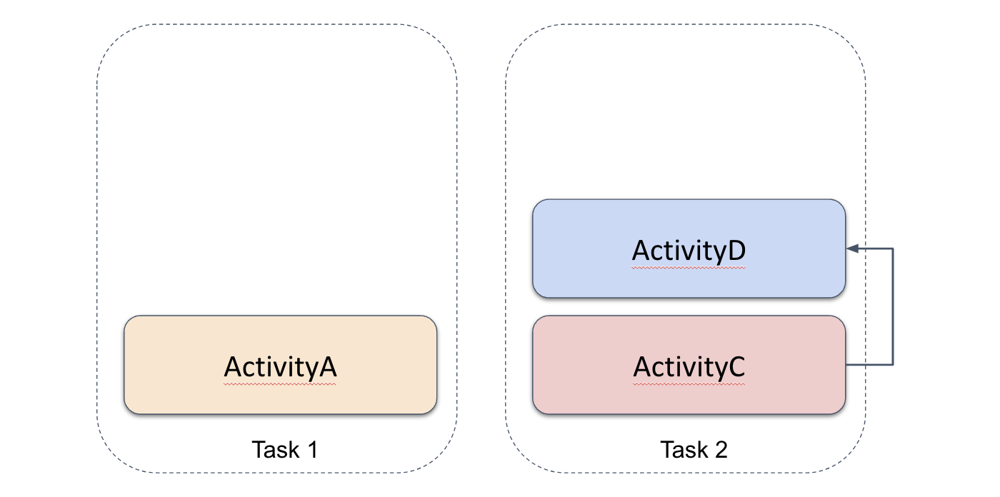
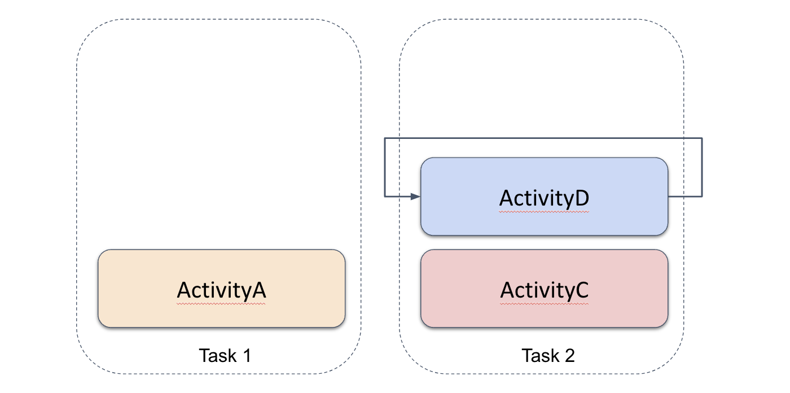
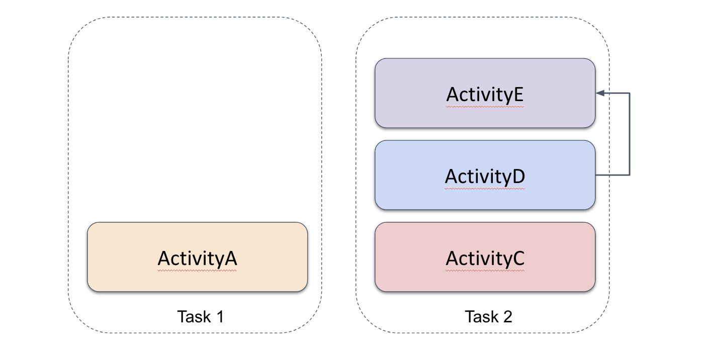
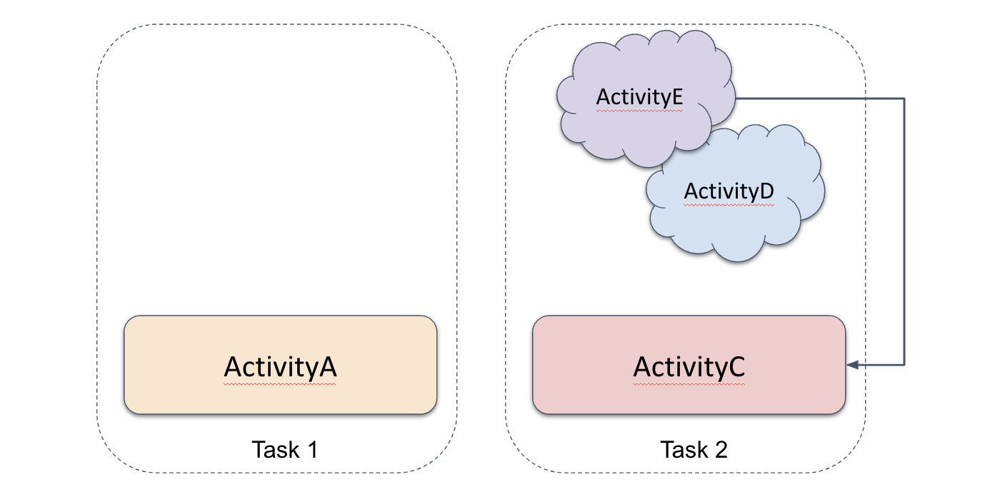

# Практическая работа Activity - LaunchMode

***[Read in English](#practice-activity---launchmode)***

## Задача
В проекте создано 5 Activity: `ActivityA`, `ActivityB`, `ActivityC`, `ActivityD`, `ActivityE`.
Вам предстоит расставить параметры манифеста и флаги Intent для Activity так, чтобы приложение вело себя следующим образом:

1. `ActivityA` - стартовая Activity для приложения, нужно добавить необходимые параметры в манифест.
   
2. При нажатии кнопки `Open ActivityB` в `ActivityA` создается новый экземпляр `ActivityB` в текущей задаче.
   
3. При нажатии кнопки `Close` в `ActivityB` закрывается `ActivityB` и возвращаемся на `ActivityA`.
4. При нажатии кнопки `Open ActivityC` в `ActivityB` создается новый экземпляр `ActivityC` в отдельной задаче.
   
5. При нажатии кнопки `Open ActivityA` в `ActivityC` запускается существующая `ActivityA` и получает новый Intent. Все остальные Activity в задаче выше по стеку удаляются.
   
6. При нажатии кнопки `Open ActivityD` в `ActivityC` создается новый экземпляр `ActivityD` в той же задаче, что и `ActivityC`.
   
7. При нажатии кнопки `Open ActivityD` в `ActivityD` она получает новый Intent.
   
8. При нажатии кнопки `Open ActivityE` в `ActivityD` создается новый экземпляр `ActivityE` в той же задаче.
   
9. При нажатии кнопки `Open ActivityD` в `ActivityE` создается новый экземпляр `ActivityD` в той же задаче, что и `ActivityE`.
10. При нажатии кнопки `Return to ActivityC` в `ActivityE` очистить текущую задачу до находящейся внизу стека `ActivityC`, которая получает новый Intent.
   

## Полезные ссылки

1. [Задачи и back stack](https://developer.android.com/guide/components/activities/tasks-and-back-stack)
2. [Intent и флаги](https://developer.android.com/reference/android/content/Intent)

---

# Practice: Activity - LaunchMode

## Task
The project has 5 Activities: `ActivityA`, `ActivityB`, `ActivityC`, `ActivityD`, `ActivityE`.
You need to set the manifest parameters and Intent flags for the Activities so that the application behaves as follows:

1. `ActivityA` is the starting Activity for the application; you need to add the necessary parameters to the manifest.
   
2. When the `Open ActivityB` button is clicked in `ActivityA`, a new instance of `ActivityB` is created in the current task.
   
3. When the `Close` button is clicked in `ActivityB`, `ActivityB` is closed, and we return to `ActivityA`.
4. When the `Open ActivityC` button is clicked in `ActivityB`, a new instance of `ActivityC` is created in a separate task.
   
5. When the `Open ActivityA` button is clicked in `ActivityC`, the existing `ActivityA` is launched and receives a new Intent. All other Activities in the task 
   higher up the stack are removed.
   
6. When the `Open ActivityD` button is clicked in `ActivityC`, a new instance of `ActivityD` is created in the same task as `ActivityC`.
   
7. When the `Open ActivityD` button is clicked in `ActivityD`, it receives a new Intent.
   
8. When the `Open ActivityE` button is clicked in `ActivityD`, a new instance of `ActivityE` is created in the same task.
   
9. When the `Open ActivityD` button is clicked in `ActivityE`, a new instance of `ActivityD` is created in the same task as `ActivityE`.
10. When the `Return to ActivityC` button is clicked in `ActivityE`, clear the current task down to the `ActivityC` at the bottom of the stack, which receives a new Intent.
   

## Useful links

1. [Tasks and the back stack](https://developer.android.com/guide/components/activities/tasks-and-back-stack)
2. [Intent and flags](https://developer.android.com/reference/android/content/Intent)
