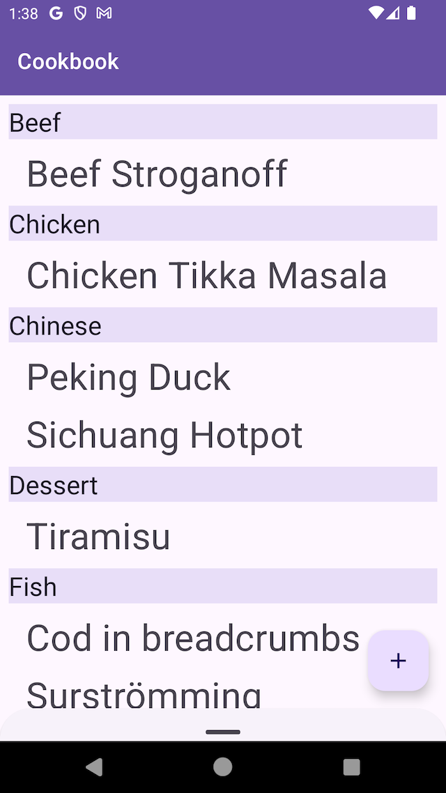
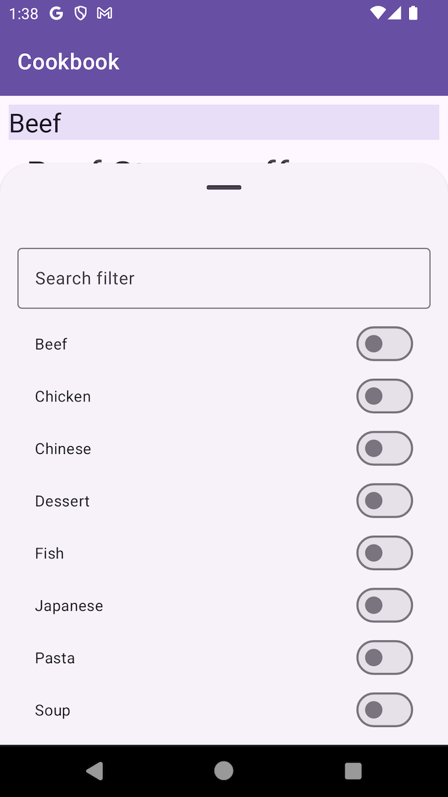
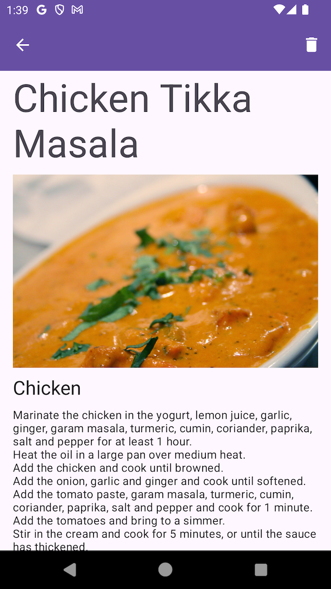
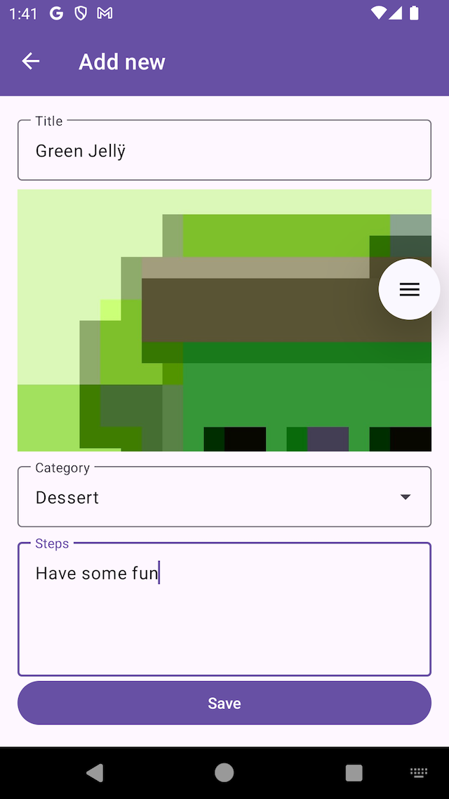

# Задание Архитектура и Навигация

В этом задании вам предстоит реализовать несколько задач на тему архитектуры и навигации в Android приложениях.
В качестве примера, рассмотрим приложение - книгу рецептов.
Визуальная часть приложения уже закончена, вам нужно реализовать логику работы с данными и навигацию между экранами.

## Задание 1. Экран списка рецептов

В этом задании вам предстоит реализовать `ViewModel` для экрана списка рецептов.
В качестве источника данных используйте `RecipeRepository`.

- Создайте `ViewModel` для экрана списка рецептов.
- Экран должен отображать список рецептов, полученных из `RecipeRepository`.
- Напишите простой тест для проверки получения списка рецептов.

## Задание 2. Фильтрация рецептов

Для отображения и изменения фильтра рецептов, мы используем `BottomSheet`, показанный на экране.
Добавьте в модель экрана свойства для управлением:

- текущим текстовым фильтром рецептов
- списком выбранных категорий. Если ни одна категория не выбрана, то отображаются все рецепты.
- обновляйте список рецептов при изменении фильтра.
- напишите тесты для проверки фильтрации рецептов.

## Задание 3. Экран деталей рецепта

Добавьте фрагмент для отображения деталей рецепта в навигационный граф.
При нажатии на рецепт в списке, открывайте фрагмент с деталями рецепта.

## Задание 4. Удаление рецепта

Добавьте возможность удалить рецепт из списка при нажатии иконки удаления на экране деталей рецепта.
При нажатии на иконку удаления, открывайте диалоговое окно с подтверждением удаления.
После подтверждения удаления, возвращайтесь на экран списка рецептов.

## Задание 5. Добавление рецепта

Добавьте возможность добавить новый рецепт в список.
При нажатии на кнопку добавления, открывайте экран добавления рецепта.
Реализуйте `ViewModel` для экрана добавления рецепта.

- При заполнении поля категории, фильтруйте список категорий по введенному тексту и помещайте его в поле `categories`.
- Разрешайте добавить рецепт только если заполнены поля: название, категория, шаги приготовления.
- Динамически обновляйте доступность кнопки добавления рецепта в зависимости от заполненности полей.
- Предусмотрите возможность пережить смерть приложения во время добавления рецепта и восстановить данные.

