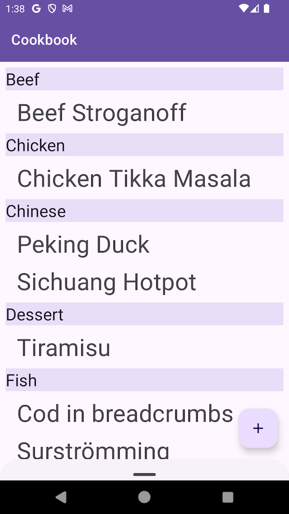
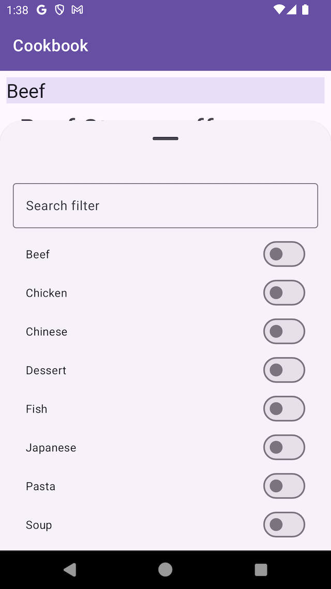
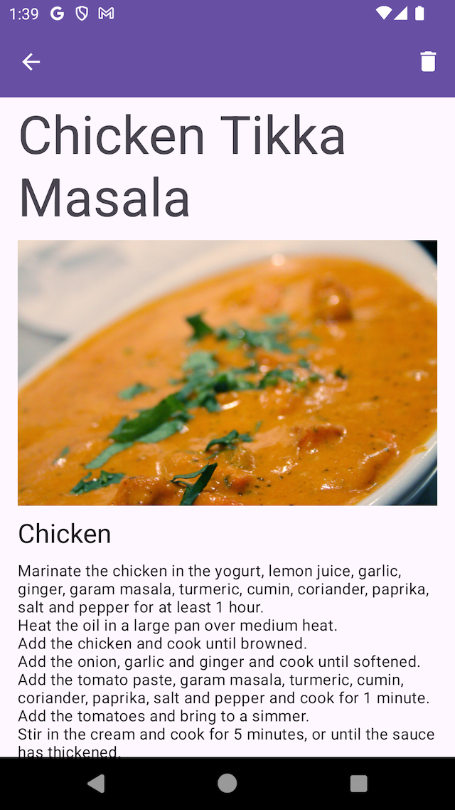
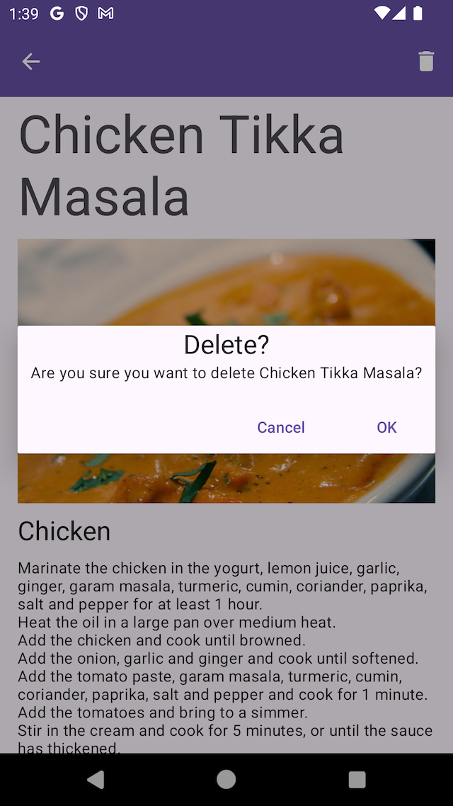
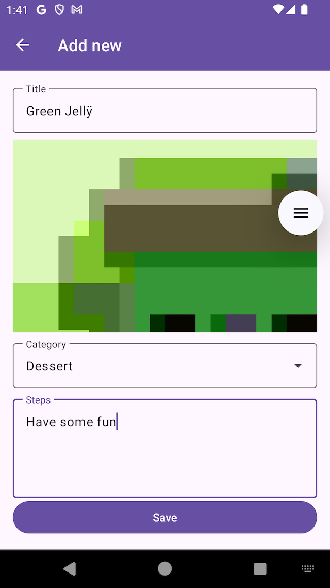

# Задание Архитектура и Навигация

***[Read in English](#assignment-architecture-and-navigation)***

В этом задании вам предстоит реализовать несколько задач на тему архитектуры и навигации в Android приложениях.
В качестве примера, рассмотрим приложение - книгу рецептов.
Визуальная часть приложения уже закончена, вам нужно реализовать логику работы с данными и навигацию между экранами.

## Задание 1. Экран списка рецептов

В этом задании вам предстоит реализовать `ViewModel` для экрана списка рецептов.
В качестве источника данных используйте `RecipeRepository`.

- Создайте `ViewModel` для экрана списка рецептов.
- Экран должен отображать список рецептов, полученных из `RecipeRepository`.
- Напишите простой тест для проверки получения списка рецептов.

## Задание 2. Фильтрация рецептов

Для отображения и изменения фильтра рецептов, мы используем `BottomSheet`, показанный на экране.
Добавьте в модель экрана свойства для управлением:

- текущим текстовым фильтром рецептов
- списком выбранных категорий. Если ни одна категория не выбрана, то отображаются все рецепты.
- обновляйте список рецептов при изменении фильтра.
- напишите тесты для проверки фильтрации рецептов.

## Задание 3. Экран деталей рецепта

Добавьте фрагмент для отображения деталей рецепта в навигационный граф.
При нажатии на рецепт в списке, открывайте фрагмент с деталями рецепта.

## Задание 4. Удаление рецепта

Добавьте возможность удалить рецепт из списка при нажатии иконки удаления на экране деталей рецепта.
При нажатии на иконку удаления, открывайте диалоговое окно с подтверждением удаления.
После подтверждения удаления, возвращайтесь на экран списка рецептов.

## Задание 5. Добавление рецепта

Добавьте возможность добавить новый рецепт в список.
При нажатии на кнопку добавления, открывайте экран добавления рецепта.
Реализуйте `ViewModel` для экрана добавления рецепта.

- При заполнении поля категории, фильтруйте список категорий по введенному тексту и помещайте его в поле `categories`.
- Разрешайте добавить рецепт только если заполнены поля: название, категория, шаги приготовления.
- Динамически обновляйте доступность кнопки добавления рецепта в зависимости от заполненности полей.
- Предусмотрите возможность пережить смерть приложения во время добавления рецепта и восстановить данные.

---

# Assignment: Architecture and Navigation

In this assignment, you will implement several tasks on the topic of architecture and navigation in Android applications.
As an example, let's consider a recipe book application.
The visual part of the application is already finished; you need to implement the data logic and navigation between screens.

## Task 1. Recipe List Screen

In this task, you will implement a `ViewModel` for the recipe list screen.
Use `RecipeRepository` as the data source.

- Create a `ViewModel` for the recipe list screen.
- The screen should display a list of recipes obtained from `RecipeRepository`.
- Write a simple test to verify the retrieval of the recipe list.

## Task 2. Recipe Filtering

To display and change the recipe filter, we use a `BottomSheet` shown on the screen.
Add properties to the screen model to manage:

- the current text filter for recipes
- the list of selected categories. If no category is selected, all recipes are displayed.
- update the recipe list when the filter changes.
- write tests to verify recipe filtering.

## Task 3. Recipe Details Screen

Add a fragment to display recipe details to the navigation graph.
When a recipe in the list is clicked, open the fragment with the recipe details.

## Task 4. Deleting a Recipe

Add the ability to delete a recipe from the list by clicking the delete icon on the recipe details screen.
When the delete icon is clicked, open a confirmation dialog.
After confirming the deletion, return to the recipe list screen.

## Task 5. Adding a Recipe

Add the ability to add a new recipe to the list.
When the add button is clicked, open the add recipe screen.
Implement a `ViewModel` for the add recipe screen.

- When filling in the category field, filter the list of categories by the entered text and put it in the `categories` field.
- Allow adding a recipe only if the following fields are filled: name, category, cooking steps.
- Dynamically update the availability of the add recipe button depending on whether the fields are filled.
- Provide the ability to survive application death while adding a recipe and restore the data.
